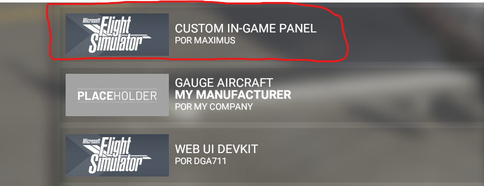
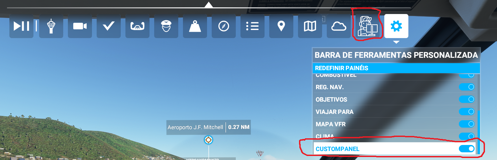
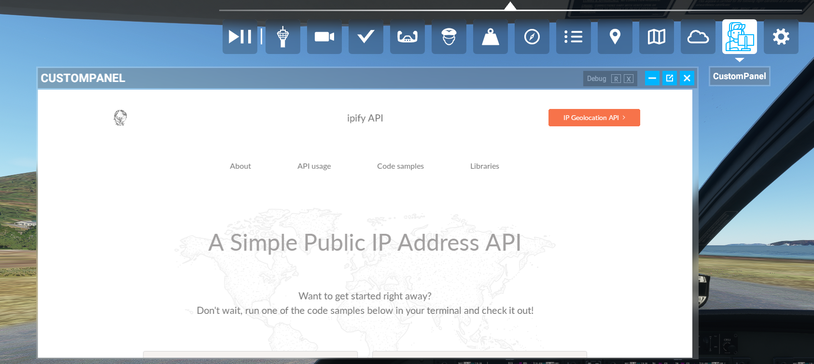

# msfs2020-toolbar-window-template
Microsoft FlightSimulator 2020 Toolbar Extra Window Template, this example loads UI window with ipify.org website SINCE SKYVECTOR is now blocking their website being loaded from iframe “X-Frame-Options“ = “SAMEORIGIN“.

To build the SPB if you have changed UI panel template definition run `build.bat` or manually

`SDK\Tools\bin\fspackagetool.exe maximus-ingamepanels-custom\Build\maximus-ingamepanels-custom.xml -nomirroring`

It will generate the SPB at `maximus-ingamepanels-custom\Build\Packages\maximus-ingamepanels-custom\Build` copy the SPB to `maximus-ingamepanels-custom\InGamePanels`.

Copy the package to community folder BUT DO NOT COPY the `maximus-ingamepanels-custom\Build` directory.

## Screenshots

#
## Please, if you like the source/my addons, consider making a donation to support me/keep development of this and new addons, any amount is welcome. I will buy MSFS2020 from steam since my current version is from a limited game pass access which will be ended. Thank you.
 
 

 
 
 